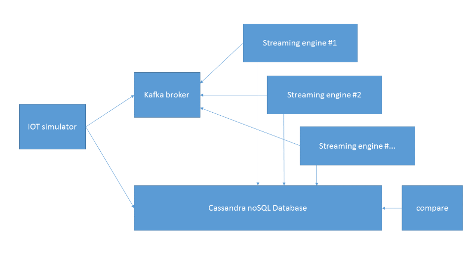

# scenarios

## Synoptic

An IOT devices simulator sends data to Kafka broker. It also writes its version of the truth to a Cassandra database. 

Stream engines (Spark Streaming, Flink, Kafka Streams, Storm, etc.) consume data from the broker and write their version of the truth to the same Cassandra database.

Some code compares the results between the simulator's version of the truth and the stream engines versions.  



The goals are to have code that shows how to do with different frameworks, compare the capabilities of different engines.

Additional goals include comparing performances, resilience to node failures, ...

## description 

IOT. Devices generate a number of measures. Each event workload will contain: 
- message id (string)
- device id (string)
- timestamp (milliseconds since epoch)
- category (string)
- measure1 (integer)
- measure2 (float)

A message may be sent several times with the same message id and should be considered as duplicates. 

this workload is sent to the broker as a pipe separated string. 

Example: 
```
123-12|123|1472209316326|cat1|456|789.12
```

which corresponds to:
- message id: "123-12"
- device id: "123"
- timestamp: 26 August 2016, 11:01:56.326 UTC
- category: "cat1"
- measure1: 456
- measure2: 789.12

Streaming processing engines get the stream and calculate aggregated values.

The following kind of exceptions are taken into account: 
- out of order
- late arrival
- duplicates

The following test cases could also be added: 
- resilience to node failures

